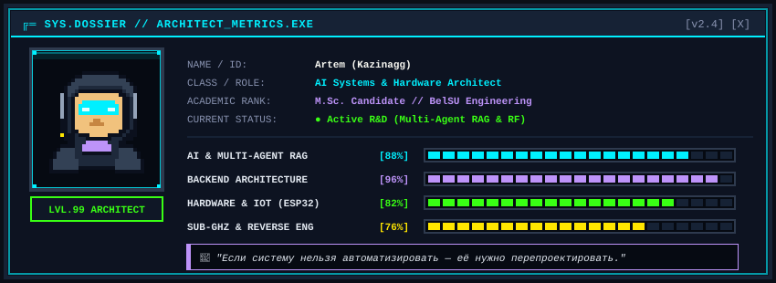
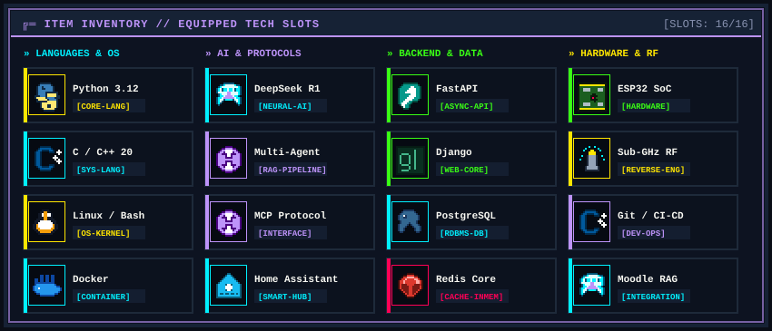
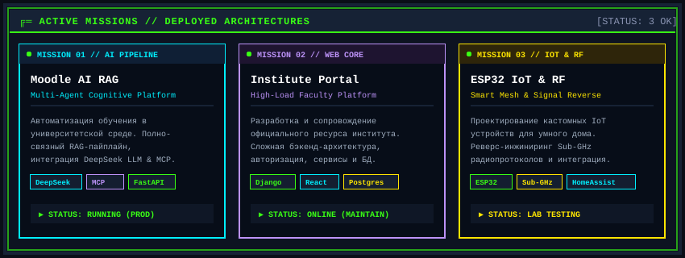

<div align="center">
  
</div>

<br>

<div align="center">
  <a href="#dossier"></a>
  <a href="#inventory"></a>
  <a href="#missions"></a>
  <a href="#activity"></a>
  <a href="#comms"></a>
</div>

<br>

<div align="center">
  
</div>

<h2 id="dossier">💾 [01] // СИСТЕМНОЕ ДОСЬЕ И ХАРАКТЕРИСТИКИ</h2>

<div align="center">
  
</div>

<br>

> **Инженерный профиль:** Разработчик и магистрант инженерных систем. Специализируюсь на проектировании отказоустойчивых бэкенд-сервисов, интеграции мультиагентных RAG-пайплайнов на базе нейросетей (DeepSeek, MCP) и разработке аппаратно-программных комплексов на базе микроконтроллеров ESP32 и радиопротоколов Sub-GHz.

<details>
<summary><b>📂 [РАСКРЫТЬ ДАННЫЕ ТЕРМИНАЛА: ИНЖЕНЕРНЫЕ СПЕЦИФИКАЦИИ]</b></summary>
<br>

```yaml
system_spec:
  architect: "Artem (Kazinagg)"
  role: "AI Systems & Hardware Architect"
  location: "Belgorod // Lab-01"
  academic: "M.Sc. Candidate, BelSU Engineering"
  core_stack:
    ai_rag: ["DeepSeek R1/V3", "Multi-Agent Frameworks", "MCP", "ChromaDB/pgvector"]
    backend: ["FastAPI", "Django Core", "PostgreSQL", "Redis", "Docker"]
    hardware_rf: ["ESP32 Dual-Core", "FreeRTOS", "Sub-GHz RF (433/868 MHz)", "Home Assistant"]
    languages: ["Python 3.12", "C++20", "C", "Bash", "SQL"]
  motto: "Если систему нельзя автоматизировать — её нужно перепроектировать."
```

</details>

<br>

<div align="center">
  
</div>

<h2 id="inventory">⚡ [02] // ТЕХНОЛОГИЧЕСКИЙ ИНВЕНТАРЬ (EQUIPPED SLOTS)</h2>

<div align="center">
  
</div>

<br>

<div align="center">
  
</div>

<h2 id="missions">🚀 [03] // АКТИВНЫЕ МИССИИ И ПРОЕКТЫ</h2>

<div align="center">
  
</div>

<br>

<details>
<summary><b>📂 [РАСКРЫТЬ: АРХИТЕКТУРНЫЙ ОТЧЕТ ПО ПРОЕКТАМ]</b></summary>
<br>

| Миссия / Проект | Стек & Протоколы | Архитектурная роль и результаты |
| :--- | :--- | :--- |
| **Moodle AI RAG Engine** | `DeepSeek` `MCP` `FastAPI` | Мультиагентный RAG-конвейер для семантического поиска и интеллектуальной помощи студентам и преподавателям внутри Moodle. |
| **Institute Web Platform** | `Django` `React` `PostgreSQL` | Официальный информационный портал института: проектирование схемы БД, высокая доступность, кастомная аутентификация и микросервисы. |
| **ESP32 IoT & Sub-GHz RF** | `ESP32` `Sub-GHz` `Home Assistant` | Исследование и декодирование проприетарных Sub-GHz радиопакетов, интеграция кастомных беспроводных узлов в экосистему умного дома. |

</details>

<br>

<div align="center">
  
</div>

<h2 id="activity">👾 [04] // СЕТКА АКТИВНОСТИ (CONTRIBUTION GRID)</h2>

<div align="center">
  <picture>
    <source media="(prefers-color-scheme: dark)" srcset="https://raw.githubusercontent.com/Kazinagg/Kazinagg/output/github-contribution-grid-snake-dark.svg">
    <source media="(prefers-color-scheme: light)" srcset="https://raw.githubusercontent.com/Kazinagg/Kazinagg/output/github-contribution-grid-snake.svg">
    
  </picture>
</div>

<br>

<div align="center">
  
</div>

<h2 id="comms">📡 [05] // КАНАЛ СВЯЗИ (INCOMING TRANSMISSION)</h2>

<div align="center">
  <a href="https://t.me/Kazinagg">
    
  </a>
</div>

<br>

<div align="center">
  <code>[SYS_EXIT: 0x00] // SESSION TERMINATED SUCCESSFULLY // READY_PLAYER_ONE</code>
</div>